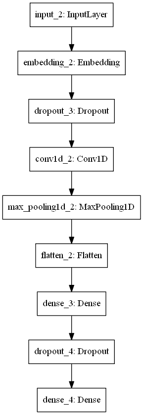
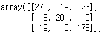

# Youtube-Downloader with classification function
- 분류기능이 있는 유튜브 다운로드 프로그램입니다.

# ⬛️팀 소개
  

- 팀명 : JM  
- 팀원 : 최정명(1인)  

# ⬛️작품의 개요 및 기대효과  
  ### 작품 개요  
  - 최근 유튜브 혹은 네이버tv 등 스트리밍 방식으로 영상을 시청할 수 있는 서비스가 있지만 영상 데이터인 만큼 많은 데이터가 소모되는것이 큰 단점이다. 유튜브를 통해 1시간 동안 동영상을 시청할 시 대략 [1.1기가의 데이터가 소모된다](https://mynotepad.tistory.com/448)는 실험 결과가 있다. 요즘은 무제한 데이터 요금제가 존재하지만 일정 데이터 사용량의 제한을 초과하면 동영상 스트리밍이 안될 정도로 느리게 느리게 하는 속도 제한 제약 또한 존재한다.
  - 시청할 유튜브 영상을 미리 다운로드 해둔다면 이런 걱정거리들이 없어질 것이다. 영상 스트리밍 시 화질 저하 문제도 미리 일정한 해상도로 다운로드 할 수 있기 때문에 해결이 된다. 더불어 유튜브의 영상은 평균 10분 이하이기 때문에 한번에 많은 영상을 다운로드 받아 보관할 것이다. 이 때 많은 영상들 속에서 원하는 영상을 즉시 찾기 힘든 문제가 있다. 이를 해결하기 위해 딥러닝 모델을 사용하여 다운로드 받을 영상의 정보들을 통해 자동으로 주제별 폴더 정리가 되도록하여 사용자의 편의를 더하였다.  
  
  ### 기대 효과  
  - 영상을 다운로드 한다는 점에 있어서 다른 서비스와 겹치지만 자동으로 영상을 분류하여 정리해준다는 점에서 사용자의 편의를 저했다.
  - 영상을 많이 보는 요즘 자신의 핸드폰이나 태블릿에 영상을 저장함으로써 데이터 소모의 걱정을 덜 수 있다. 또한 이미 다운로드 된 영상이기 때문에 영상 시청 중에 네트워크 상태로 인한 화질저하 문제도 막을 수 있다.
  
  
  
# ⬛️구현
  - 사용 언어 : Python
  - 프로젝트에 주로 사용된 라이브러리 : [Pytube](https://python-pytube.readthedocs.io/en/latest/), [PyQT5](https://pypi.org/project/PyQt5/), [Keras(backend=tensorflow)](https://www.tensorflow.org/guide/keras?hl=ko), [konlpy](https://konlpy-ko.readthedocs.io/ko/v0.4.3/), [gensim](https://pypi.org/project/gensim/)
  ### Source
  - 분류에 사용될 데이터를 수집 : [YoutubeCrawl.py](https://github.com/JeongMyeong/Youtube-Downloader/blob/master/YoutubeCrawl.py)
  - 수집한 데이터를 학습 : [Subject_Classification.ipynb](https://github.com/JeongMyeong/Youtube-Downloader/blob/master/Subject_Classification.ipynb)
  - PyQT5로 GUI 프로그램 제작 : [YoutubeDownloader.py](https://github.com/JeongMyeong/Youtube-Downloader/blob/master/YoutubeDownloader.py)
  - 프로그램에서 처리되는 부분(데이터분류, 유튜브 정보 받아오기) : [processed_classification.py](https://github.com/JeongMyeong/Youtube-Downloader/blob/master/processed_classification.py)
 
# ⬛️Classification Model
  ### 학습데이터
    - 게임, 음악, IT 관련 유튜브 영상의 제목 약 2400개
    - 게임 : 915개
    - 음악 : 788개
    - IT   : 741개
  ### 학습 모델  
    
  
  ### 모델 성능
   - 오차행렬(게임, 음악, IT 순)
    
   - 검증 데이터셋에 대한 분류 정확도  
     - 약 91.5%  
     
# ⬛️사용방법
  이 프로그램의 사용방법은 간단하다. 유튜브에서 검색하듯이 키워드로 검색을 하여 다운로드 받고 싶은 영상을 클릭 후 [해상도 보기] 버튼을 눌려 다운로드 하고싶은 화질을 누른다. 그 후 다운로드 받을 폴더를 지정하고 저장하면 해당 폴더에 저장이 된다. [자동분류]를 체크하면 동영상 파일을 자동으로 분류하여 폴더가 생성되고 저장이 된다. [자동분류] 체크를 해제하면 동영상 파일은 지정한 폴더에 저장이 된다.
